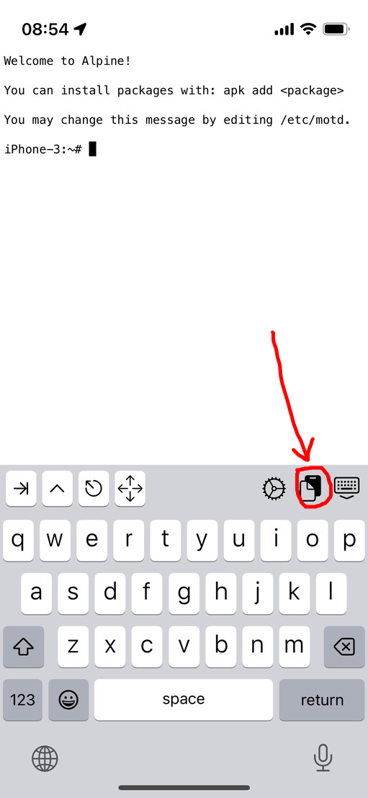
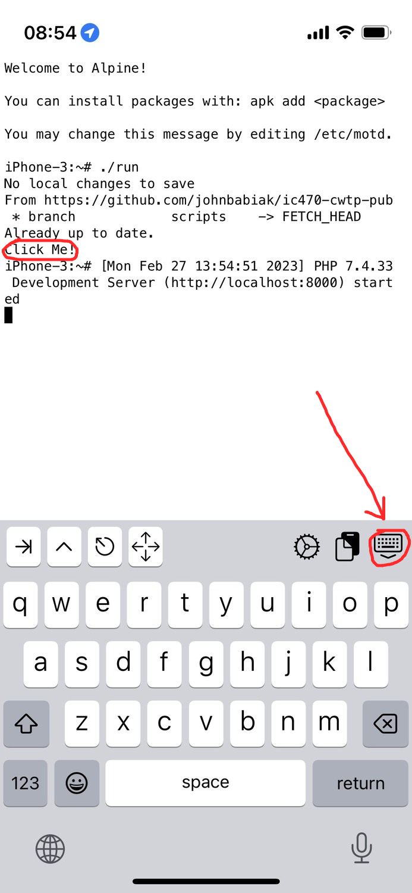

# IC470 CWTP

## Cyber Warfare Training Platform

USNA Capstone Project for AY'23

Customer: Dr. Dane Brown

Team Members: John Babiak, Antawn Weg, Sarah Yo

To install, copy the following line into iSH:
```
apk add git; git config --global pack.threads "1"; git clone https://github.com/johnbabiak/ic470-cwtp-pub.git; cd ic470-cwtp-pub; git pull origin dev; chmod +x install.sh; ./install.sh
```

In the iSH app, you can paste using this button:



Once the script is done installing, click the "Click Me!" link to open the CWTP. You will have to lower the keyboard in order to open the link.



If the iSH app prompts you to use location services, allow it to use your location. This is so the app can run in the background and makes the CWTP work.

If you close the iSH app and want to run the system again, simply open the app and type "./run" to run the system then click the "Click Me!" link to access it.


Filenames and locations:

```
/root
	- create_table.txt
	- cwtp.db (created upon installation of system)
	- index.php
	- install.sh
	- keybdown.png
	- login.php
	- logout.php
	- paste.png
	- README.md (this file!)
	- register.php
	- run
	- tools.php
	- utils.php
	/challenges
		/'Example 1'/
			- 'Example 1.php'
			- fs_example.png
	/tools
		/base64
			- base64.php
		/shell
			- shell.php
```
